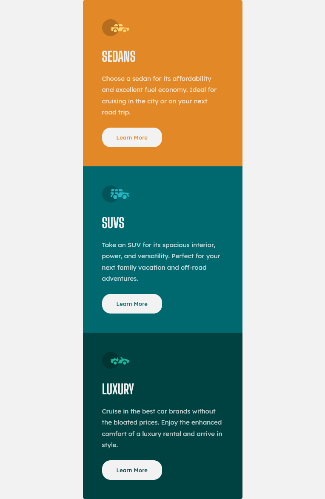
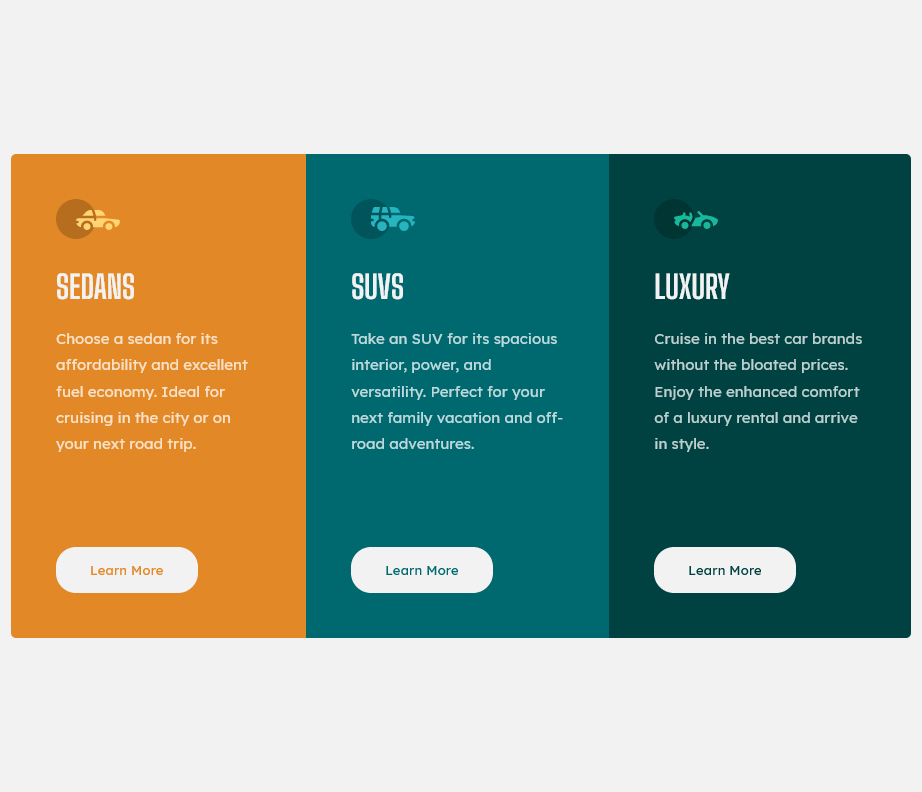

# Frontend Mentor - 3-column preview card component solution

This is a solution to the [3-column preview card component challenge on Frontend Mentor](https://www.frontendmentor.io/challenges/3column-preview-card-component-pH92eAR2-). Frontend Mentor challenges help you improve your coding skills by building realistic projects.

## Table of contents

- [Overview](#overview)
  - [The challenge](#the-challenge)
  - [Screenshot](#screenshot)
  - [Links](#links)
- [My process](#my-process)
  - [Built with](#built-with)
  - [What I learned](#what-i-learned)
  - [Continued development](#continued-development)
  - [Useful resources](#useful-resources)
- [Author](#author)

## Overview

### The challenge

Users should be able to:

- View the optimal layout depending on their device's screen size
- See hover states for interactive elements

### Screenshot

### Links

- Solution URL: [Add solution URL here](https://your-solution-url.com)
- Live Site URL: [Add live site URL here](https://your-live-site-url.com)

## My process

### Built with

- Semantic HTML5 markup
- CSS custom properties
- Flexbox
- Mobile-first workflow

### What I learned

I learned a little more about css flexboxes were a real time saver as I feel it did not take as long as the last project. I do still get the cross axis and main axis mixed up, but I think I am slowly getting the hang of it.

### Continued development

I feel that I am a little bit more comfortable with css and flexboxes so I am moving on to css frameworks and javascript as my next projects.

### Useful resources

- [resource 1](https://flexbox.malven.co/) - This website gave me a simple referecne to flexboxes that I could look back on quickly.
- [resource 2](https://developer.mozilla.org/en-US/docs/Web/CSS) - Since I am learning Css over again, this was a helpful resource for looking up things that I forgot.

## Author

- Frontend Mentor - [@adrianna450](https://www.frontendmentor.io/profile/adrianna450)
